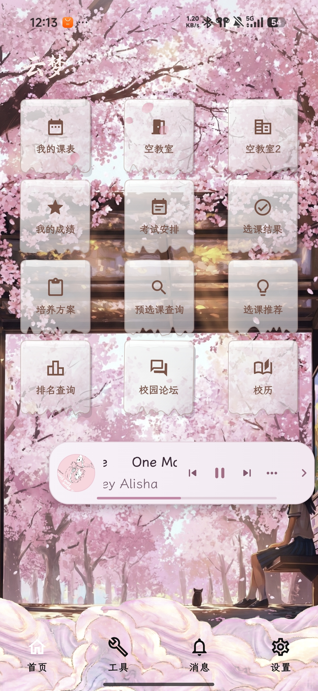
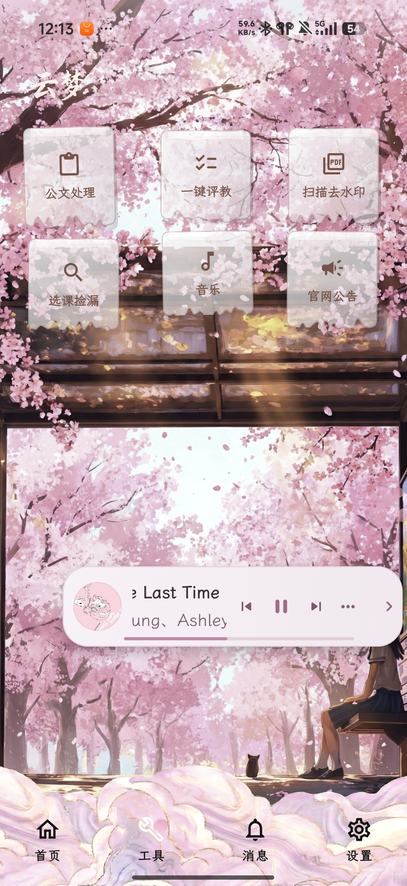
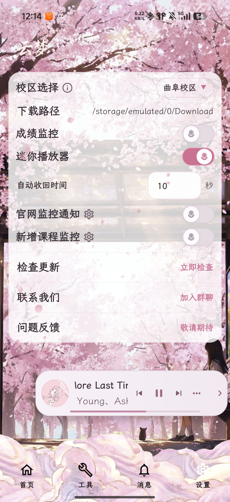
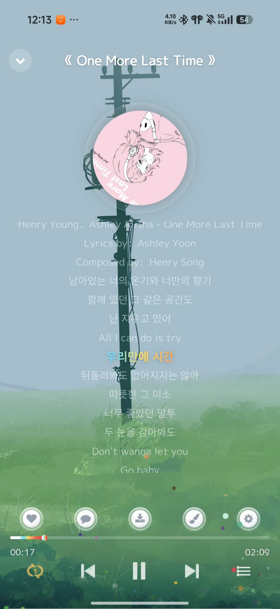

# 云梦（Rain）

面向在校生的校园教务与效率助手。课表、成绩、考试、培养方案、空教室、论坛、选课提醒和常用工具，都集中在一个更统一的 Android 应用里。

`Android 8.0+` `Kotlin` `Jetpack Compose` `校园教务辅助`

## 项目简介

云梦主要解决两类问题：

- 把常用教务入口集中起来，减少来回切网页和重复登录的成本。
- 把监控、提醒、桌面组件和工具页补齐，让应用不只是“能查”，也能长期常用。

界面整体采用樱花主题，保留了比较明显的视觉风格，同时尽量把功能路径做得直接一些，避免只好看不好用。

## 主要功能

### 教务核心

- 登录与会话保持
- 我的课表、学期课表、自定义课程
- 我的成绩、GPA 计算器、成绩可视化
- 考试安排、选课结果、培养方案
- 空教室查询、预选课查询、选课推荐、排名查询
- 校历查看，支持缩放和拖动

### 监控与提醒

- 成绩监控
- 官网公告监控
- 选课捡漏监控
- 消息中心
- 应用更新提示

### 扩展工具

- 一键评教
- 校园论坛
- 公文处理
- 扫描 PDF 去水印
- 音乐模块
- 常用网页工具入口

## 界面预览

### 登录与主界面

<p align="center">
  
  
  
  
</p>

### 音乐模块

<p align="center">
  
  
  
</p>

<p align="center">
  
  
</p>

## 体验特点

- 首页用卡片收纳高频入口，教务主线比较集中。
- 对成绩、公告和选课这类会变化的信息，提供后台监控能力。
- 樱花主题、半透明卡片和迷你播放器让界面辨识度更高。
- 提供桌面组件，包括今日课程、考试倒计时和快捷入口。

## 技术栈

- Kotlin + Jetpack Compose
- Navigation Compose + Material 3
- Hilt + KSP
- OkHttp + Jsoup
- DataStore + WorkManager
- Media3、ML Kit、PDFBox、Apache POI、Tencent X5

## 项目结构

```text
app/
├── src/main/java/com/love/rain/
│   ├── data/      # 网络、解析、仓储、监控任务
│   ├── ui/        # Compose 页面、导航、主题、播放器
│   ├── widget/    # 桌面小组件
│   └── MainActivity.kt
├── src/main/res/  # 资源与清单配置
└── src/test/java/ # JVM 单元测试
```

## 本地构建

```bash
./gradlew :app:assembleDebug
./gradlew :app:testDebugUnitTest
./gradlew :app:lintDebug
```

Windows 下可以使用：

```powershell
.\gradlew :app:assembleDebug
.\gradlew :app:testDebugUnitTest
.\gradlew :app:lintDebug
```

## 使用说明

1. 打开应用并完成登录。
2. 从首页进入课表、成绩、考试、培养方案等常用功能。
3. 需要提醒时，可以在设置页开启成绩监控、公告监控和选课监控。
4. 工具页提供音乐、公文处理、扫描去水印等扩展能力。

## 项目说明

- 最低支持 Android 8.0（API 26）。
- 当前版本信息以应用内显示为准。
- 项目目前以个人维护和功能迭代为主，README 主要用于展示与说明。
- 涉及教务、评教和监控能力时，请以学校规则和账号安全为前提使用。
